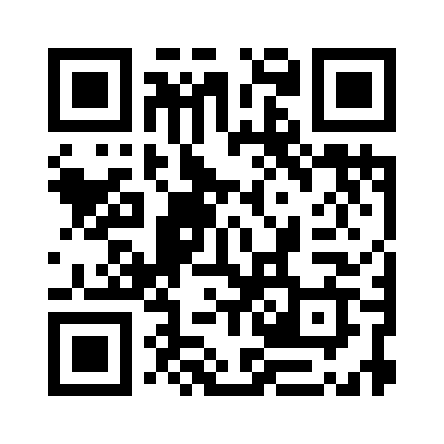

# Codex QR Code Skill

[](https://github.com/bogi1203/codex-qr-code-skill/releases)
[](LICENSE)
[](qr-code/SKILL.md)

這是一個給 OpenAI Codex 使用的離線 QR code generator skill。安裝後，當使用者需要手機掃描、網站連結、美術素材、demo 連結、本機預覽、社群貼文、分享頁面或 QR 碼時，Codex 可以自動調用這個 `qr-code` skill 產生 PNG 或 SVG QR code。

## 下載 / 快速安裝

**直接下載 ZIP：** [qr-code-skill.zip](https://github.com/bogi1203/codex-qr-code-skill/releases/download/v0.1.0/qr-code-skill.zip)

**Windows PowerShell 安裝：**

```powershell
$zip = Join-Path $env:TEMP "qr-code-skill.zip"
$skills = Join-Path $env:USERPROFILE ".codex\skills"
New-Item -ItemType Directory -Force $skills | Out-Null
Invoke-WebRequest -Uri "https://github.com/bogi1203/codex-qr-code-skill/releases/download/v0.1.0/qr-code-skill.zip" -OutFile $zip
Expand-Archive -Path $zip -DestinationPath $skills -Force
Remove-Item $zip
```

**macOS / Linux 安裝：**

```bash
mkdir -p ~/.codex/skills
curl -L -o /tmp/qr-code-skill.zip "https://github.com/bogi1203/codex-qr-code-skill/releases/download/v0.1.0/qr-code-skill.zip"
unzip -o /tmp/qr-code-skill.zip -d ~/.codex/skills
rm /tmp/qr-code-skill.zip
```

安裝後重開 Codex。

## 搜尋關鍵字

Codex skill、OpenAI Codex skill、Codex QR code、QR code generator、qrcode generator、離線 QR 產生器、手機掃描連結、PNG QR code、SVG QR code、AI agent skill、agent workflow、網站 QR 碼、設計 QR 碼、demo link QR code。

## 適合用在

- 想讓 Codex 在網站、App、設計或發佈流程中自動產生 QR code 的使用者。
- 需要分享 demo link、preview URL、local tunnel、文件、dashboard、landing page 的開發者。
- 需要把 QR code 放進海報、mockup、社群圖片、印刷素材或客戶預覽圖的設計師與創作者。
- 不想依賴第三方 QR 網站、希望在 AI agent workflow 裡本機生成 QR code 的人。

## 功能

- 本機生成，不依賴線上 QR 服務。
- 支援 PNG，適合預覽、社群貼文、截圖、一般分享。
- 支援 SVG，適合網站、印刷、設計工具。
- 支援 UTF-8，包括繁體中文文字與網址。
- 內建 QR version 選擇、Reed-Solomon 錯誤修正、mask 評分。
- `agents/openai.yaml` 已設定可隱式調用。

## 安裝

如果要手動安裝，下載這個 repo 或 `dist/qr-code-skill.zip`，把裡面的 `qr-code` 資料夾放到 Codex skills 目錄：

```text
Windows: C:\Users\<你的帳號>\.codex\skills\qr-code
macOS/Linux: ~/.codex/skills/qr-code
```

## 使用方式

通常不需要打特殊指令，直接自然說就可以：

```text
生成 YouTube 的 QR code
幫這個網站做一個手機掃描連結
把這個 demo link 做成 QR
這個作品頁要放 QR 碼
```

如果想強制指定這個 skill：

```text
用 $qr-code 幫我生成 https://www.youtube.com/ 的 QR code
```

## 分享文案

需要在 Codex 裡自動產生 QR 碼嗎？`codex-qr-code-skill` 是一個離線 OpenAI Codex skill，可以替網站、demo、設計稿、社群貼文和分享連結產生可手機掃描的 PNG/SVG QR code。

## 範例

內容：

```text
https://www.youtube.com/
```

輸出：



SVG 版本：[examples/youtube-qrcode.svg](examples/youtube-qrcode.svg)

## Skill 結構

```text
qr-code/
  SKILL.md
  agents/openai.yaml
  scripts/make_qr.py
```

也可以直接執行腳本：

```powershell
python .\qr-code\scripts\make_qr.py "https://www.youtube.com/" --output ".\youtube-qrcode.png" --error-correction Q --scale 12 --print-json
```

## 驗證

這個 skill 已用 Codex 的 `quick_validate.py` 驗證通過，也實際產生過 PNG / SVG，測試內容包含一般 URL、繁中 URL、繁中文字串。

## 授權

MIT
